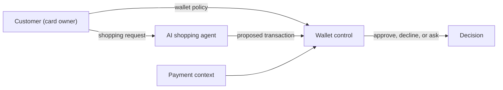

# Agent on a Leash
*Can you build the guardrails that let an AI shopping agent buy on your behalf without giving it a blank cheque?*

# Problem

Imagine an AI shopping assistant that can buy things with your credit card. Such agents are already a reality, enabled by new capabilities from Visa and Mastercard.
You ask it: "Buy me black running shoes for up to CHF 200". But how do you stay in control? How do you ensure that your AI shopping assistant:
- doesn't spend too much?
- doesn't buy from shady merchants?
- purchases what you actually intended?
- remains resilient against prompt injection attacks?

Your challenge is to build the trust and control layer that decides whether an AI agent may spend a customer's money.

# Objective

Build a prototype wallet control layer that decides whether an AI shopping agent may spend a customer's money. The wallet control layer is configured through a customer-managed wallet policy and operates independently of the AI shopping agent and its shopping instructions.

Wallet control consists of two parts:
1. Frontend:
Translate the customer's input (for example rules or a natural-language wallet policy) into clear, executable permissions such as spending limits, merchant requirements, time windows, and rules for uncertain cases. The customer must also be able to tighten, update, or revoke the wallet policy. 
2. Backend
Evaluate each proposed transaction against the wallet policy and returns one of three decisions: **approve**, **decline**, or **ask the customer** (`step_up`). Explain the decision in plain language and clearly highlight any uncertainty. If a confirmation by the customer is required, support the final approval or rejection. Track relevant state over time so rolling limits, retries, duplicate requests, and prior decisions are handled correctly without blocking ordinary purchases unnecessarily. Treat any merchant-provided text as untrusted input. It might contain prompt injections.

You build the Wallet control - not the shopping agent. The prototype should work with the supplied synthetic data and simulator, respond within the required deadline, and remain predictable if optional models or external services fail. Do not hard-code decisions to scenario names, request IDs, or sequence positions. Demonstrate one ordinary transaction completed with minimal friction, one ambiguous, unsafe, or manipulated transaction receiving a useful intervention, and the human approval, rejection, or revocation path. Judges should be able to understand what the system permitted, what evidence it considered, why it acted, and how customer retained control.

# Support for Hackers
- Synthethic data pack provided
- A live API with transactions is available during the hackathon
- Experts from Viseca will be on site during the hackathon
- Viseca hosts an online Q&A session prior to the main event

# Technical Preferences
Viseca ultimately intends to integrate control-layer configuration into the existing Viseca one mobile app, while the decision (approve/decline/ask) must meet strict latency requirements and runs in the backend. Hence we recommend decoupling the wallet-control user interface from the engine that approves, blocks, or escalates transactions, allowing each component to be integrated, deployed, and scaled independently.
If language models are used in the decision path, smaller, lower-latency models are preferred. 

# Why hack?
- **Work on a real trust problem.** The goal is not simply to block fraud. It
  is to let a person delegate useful work without losing visibility or control
  over their money.
- **Combine different disciplines.** Use rules, behavioural signals, machine
  learning, language models, interface design, or a thoughtful combination of
  them.

# About the Challenge Partner
Viseca is a leading Swiss fintech specializing in payment cards and cashless payment services. Through Viseca Card Services, it is one of Switzerland’s largest issuers of Visa and Mastercard credit cards for banks and co-branding partners. Viseca Payment Services provides the technology and operational services behind card payments, including transaction processing, customer service, and fraud prevention. Its award-winning “one” digital service gives customers convenient control over their cards and spending. Founded in 1999 and wholly owned by Swiss retail and cantonal banks, Viseca combines decades of payment expertise with a focus on making payments simple, secure, and convenient.
